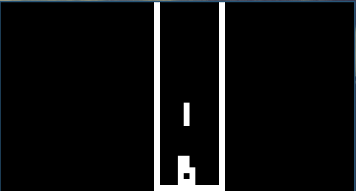

# CHIP-8 Emulator written in C++
Tetris using the CHIP-8 emulator



## Dependencies
**The emulator depends upon SFML which can be found from:**
https://www.sfml-dev.org/

## How to use
**Compile:**
```
./compile.sh
```
**Execute:**
```
./out <filepath>
```

## Roms

**Roms can be downloaded on github. I suggest to checkout:**
https://github.com/dmatlack/chip8/tree/master/roms/games

## TODO
**Right now this Emulator is an early prototypes; hence Memory leaks
is not accounted for. This will be fixed in an later update.**
** Window is tiled in I3 - looking for a floating option in SFML**


